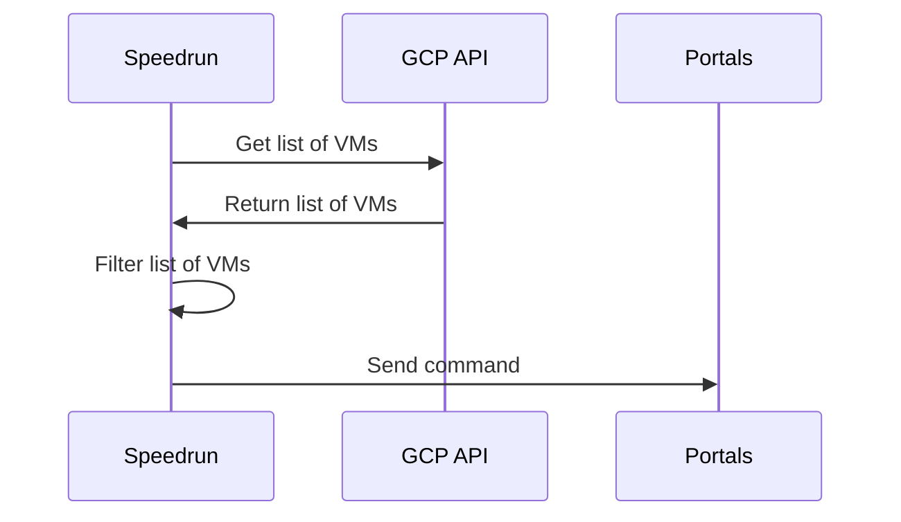

<p align="center">
  <a rel="nofollow">
    
  </a>
</p>

# Speedrun

[](https://github.com/speedrunsh/speedrun/blob/master/LICENSE)
[](https://goreportcard.com/report/github.com/speedrunsh/speedrun)
[](https://github.com/speedrunsh/speedrun/actions/workflows/go.yml)

Speedrun helps you control your compute fleet with minimal effort.

Example, stop nginx across 3k machines:

```bash
speedrun service stop nginx --target "Labels.role == 'nginx'"
```

Features:

* stateless
* serverless
* idempotent
* no complex configuration required
* service discovery via native cloud integration (currently Google Cloud only, AWS, Azure and Consul coming up!)
* extensible (plugin system is in the works)

## Installation

#### MacOS, Linux, Windows

Download the precompiled binaries from here: [Releases](https://github.com/dpogorzelski/speedrun/releases)

## Usage

#### Quickstart

On a server:

```bash
sudo ./portal --insecure
```

On your machine:

```bash
export GOOGLE_APPLICATION_CREDENTIALS=/path/to/serviceaccount.json
speedrun init
speedrun run whoami --insecure
```

## Architecture

<p align="center">
  <a rel="nofollow">
    
  </a>
</p>

#### Speedrun
Speedrun is the client. Speedrun is the CLI tool you run on your computer to send commands to your VMs.

#### Portal
Portal is the agent running on each server you want to send commands to. It will receive commands sent from Speedrun and respond with the outcome details accordingly.
#### Service Discovery
There is no server component in Speedrun's architecture. Service discovery is performed against native facilities of each supported provider such as GCP, AWS or Consul.
This eliminates the need to deploy,maintain and operate a server and all problems that would come with it as a consequence, such as: scalability, failure tolerance, redundancy, agent lifecycle management etc.



#### Protocols

Communication between Speedrun and Portals is performed via [dRPC](https://github.com/storj/drpc), a lightweight, drop-in replacement for gRPC. All dRPC interactions travel on top of TLS1.3 and can be mutually authenticated ([mTLS](https://en.wikipedia.org/wiki/Mutual_authentication)).

#### Language Definition
Speedrun supports a flexible yet simple expression language to filter Service Discovery results (`--target`), it's based on [antonmedv/expr](https://github.com/antonmedv/expr). Full language definition can be found [here](https://github.com/antonmedv/expr/blob/master/docs/Language-Definition.md).

#### Plugins
Plugins will allow you to add custom commands without altering the source code. This is not implemented yet.

## Examples

Stop Nginx on VMs that have a label `role` with value `nginx` and a label named `project` with value `someproject`

```bash
speedrun service stop nginx --target "Labels.role == 'nginx' and Labels.project == 'someproject'"
```

Run arbitrary shell command on the target machines. Ignore Portal's certificate and connect via private IP address.

```bash
speedrun run "ls -la" --target "Labels.env != 'prod'" --insecure --use-private-ip
```

Use a different config file

```bash
speedrun run whoami -c /path/to/config.toml
```

## Configuration
Default config file is located at `~/.speedrun/config.toml` and default settings can be generated via `speedrun init --print`.

#### Run Portal as a systemd service
Find a sample unit [here](init/portal.service)

#### Use self signed certificates during testing
In the [scripts](scripts/) folder you can find scripts that will help you generate:
* a CA cert/key
* Speedrun cert/key
* Portal cert/key

Run them:
```bash
scripts/generate_fake_ca.sh
scripts/generate_portal_cert.sh
scripts/generate_speedrun_cert.sh
```
This will generate the required key/cert pairs:
```
ca.crt
ca.key
portal.crt
portal.key
speedrun.crt
speedrun.key
```
Set the path in the `[tls]` config block:

Portal:
```toml
[tls]
  ca = "ca.crt"
  cert = "portal.crt"
  insecure = false
  key = "portal.key"
```
Speedrun:
```toml
[tls]
  ca = "ca.crt"
  cert = "speedrun.crt"
  insecure = false
  key = "speedrun.key"
```

## List of built-in Actions
* [x] run: run arbitrary shell commands
* [X] service: control systemd services
* [ ] file: perform file operations such as read or tail
* [ ] disk: perform storage operations such as listing partitions and available disk space
* [ ] ps: fetch process information
* [ ] top: fetch or stream high level system stats
* [ ] pkg: manage packages via default package manager
* [ ] system: host control operations such as reboot, shutdown etc.
...
## Contributing

Pull requests are welcome. For major changes, please open an issue first to discuss what you would like to change.

## Project Status

This project is in a very early stage so expect a lot of breaking changes in the nearest future

## Community & Support

Join the [Speedrun Slack](https://join.slack.com/t/slack-w9m7528/shared_invite/zt-11lyemhxe-EdWi0zqh0rIEYc85mKI6_g) and ask questions 😃

## License

[MPL-2.0](LICENSE)
